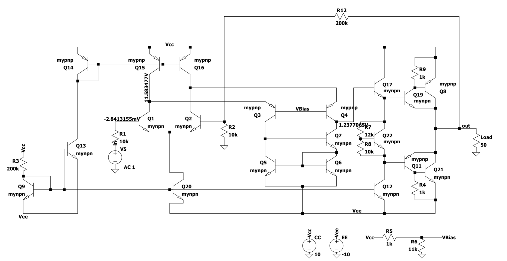
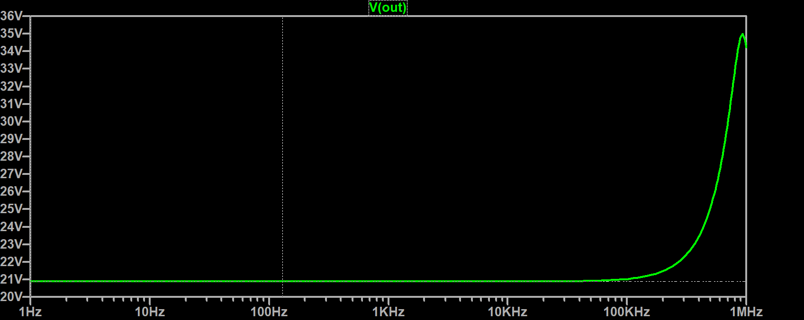
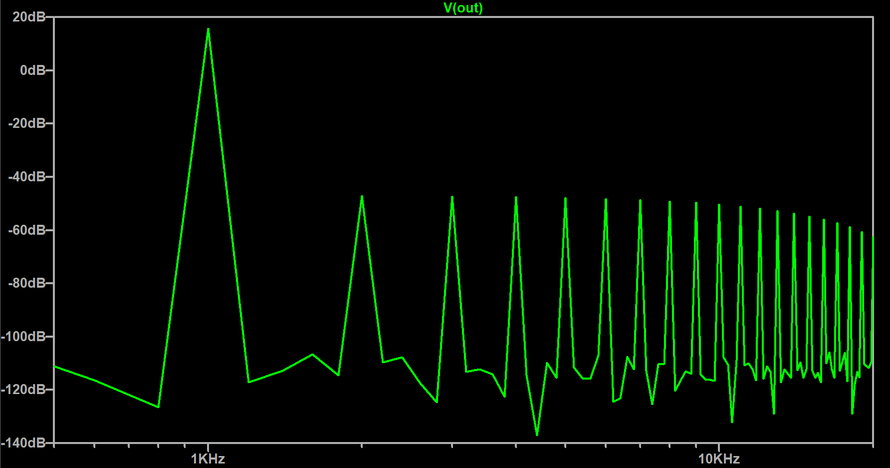
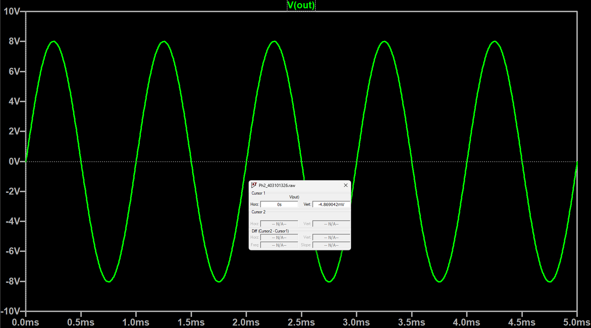

# Discrete High-Fidelity Audio Amplifier

**Author:** Mehrshad Arshad
**Course:** Electronics II, Sharif University of Technology

Two-phase discrete-transistor audio amplifier, progressing from a
high-gain open-loop stage to a closed-loop Class-AB power amplifier
capable of driving a 50Ω load. Fully validated in SPICE: gain, CMRR,
THD (clean and under injected reference noise), PSRR, input/output
resistance, and a real .wav audio pass-through test.

## Architecture

**Phase 1 — Open-loop gain stage**
- BJT differential input pair
- Folded-cascode active load for high output impedance
- Class-A Darlington emitter-follower buffer
- Single diode-referenced current mirror distributing bias to all stages

**Phase 2 — Power stage + global feedback**
- Class-AB push-pull output stage (Complementary Feedback Pair /
  Sziklai configuration) to drive a 50Ω load without excessive
  quiescent power
- V_BE multiplier for output-stage bias, tuned against the project's
  190mW total power budget
- An added emitter-follower buffer isolates the high-impedance gain
  node from the power stage's variable loading — without it, closed-loop
  distortion rose by roughly 60×
- Global negative feedback (Rf / Rg) sets closed-loop gain to ≈20

## Results

| Metric | Phase 1 (Open-Loop) | Phase 2 (Closed-Loop) | Spec Target (Ph1 / Ph2) |
| :--- | :--- | :--- | :--- |
| **Differential Gain** | 92.3 dB | — | > 54 dB / — |
| **Closed-Loop Gain** | — | 21 V/V | — / 18–22 V/V |
| **CMRR** | 118 dB | — | > 80 dB / — |
| **Output Swing** | 7.46 Vpp | 17 Vpp *(Bonus)* | > 6 Vpp / > 16 Vpp |
| **THD (Clean)** | — | 0.0074% | — / < 0.08% |
| **THD (Ref. Noise Injected)** | — | 0.039% | — / < 1% |
| **PSRR** | — | 73.98 dB | — |
| **Input Resistance** | 103 kΩ | 35.4 MΩ | > 50 kΩ / > 1 MΩ |
| **Output Resistance** | 3.9 kΩ | 0.28 mΩ | < 5 kΩ / < 50 Ω |
| **Output Stage Efficiency ($\eta_{out}$)**| — | 73.89% *(Bonus)* | — / > 60% *(Bonus: > 70%)* |
| **Power Consumption** | 24 mW ($P_Q$) | 148.6 mW ($P_{total}$) | < 60 mW / $\le$ 190 mW |
| **Cost Budget** | 155 | 200 | ≤ 200 |

## Simulation methodology notes

- Custom `.meas TRAN` / `.FOUR` directives used per-spec to extract RMS
  power, efficiency, and THD directly from transient analysis
- PSRR validated with a sawtooth-ripple supply (10mV ripple) per the
  project's mandated test method
- Noise sensitivity validated by injecting a behavioral white-noise
  voltage source in series with the bias-reference resistor, modeling
  thermal noise propagation through the current-mirror network
- Real audio validated end-to-end: WAV file normalized and resampled
  with a custom Python script (`audio/convert_audio.py`), run through
  the closed-loop transient SPICE model, confirmed clipping-free

## Files

- `Phase1_OpenLoop_Design/` — LTspice schematic + full report
- `Phase2_ClosedLoop_Design/` — LTspice schematic + full report + audio test files

## License

MIT — see [LICENSE](LICENSE)
